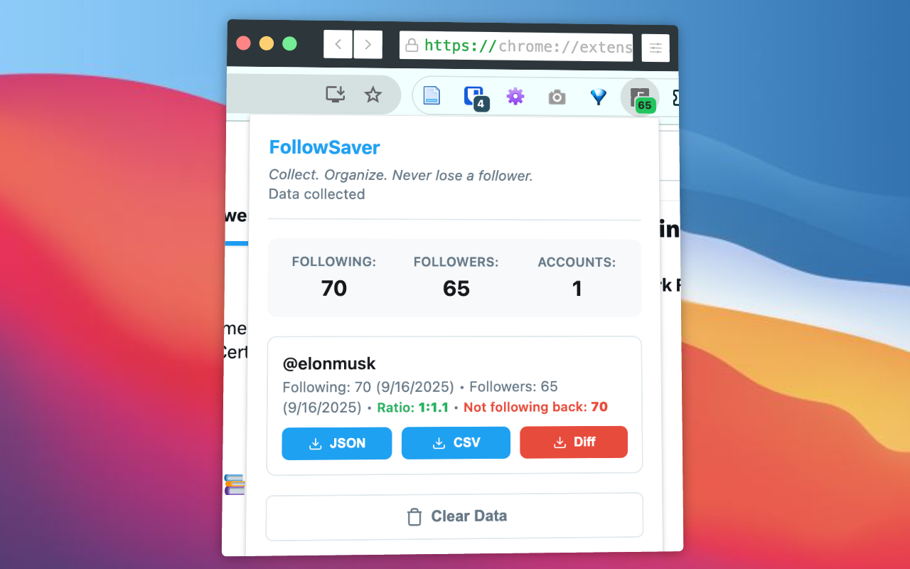

# FollowSaver

**Collect. Organize. Never lose a follower.**

Save your X/Twitter followers and following lists privately. No API required, no subscriptions, your data stays on your computer.

## 🛡️ Your Data Stays Private

- All data stored locally in your browser
- Nothing sent to external servers
- Export and delete anytime you want

## ✨ What It Does

FollowSaver collects your X/Twitter connections as you browse:

- Visit any following or followers page
- Scroll through the list - data saves as you scroll
- See counts update on the extension icon
- Export to CSV or JSON whenever you need

## 📦 Installation

1. Download the extension from [Releases](https://github.com/nibzard/followsaver/releases)
2. Open Chrome and go to [chrome://extensions/](chrome://extensions/)
3. Turn on "Developer mode" (top right)
4. Click "Load unpacked" and select the downloaded folder
5. You'll see the FollowSaver icon in your toolbar

## 🚀 How to Use

### Collect Your Data
1. Go to your X/Twitter following or followers page
2. Hit refresh and scroll down to load more users
3. The extension saves them as you scroll

### View & Export
1. Click the FollowSaver icon
2. See your collected data by account
3. Export as CSV (for spreadsheets) or JSON (complete data)
4. Clear data when you want a fresh start

### What the Colors Mean
- **Blue badge**: Collecting following list
- **Green badge**: Collecting followers list
- **Orange badge**: New data since you last checked

## 📊 Export Formats

**CSV** - Opens in Excel, Google Sheets, etc.
- Username, display name, bio
- Follower/following counts
- When you collected them

**JSON** - Complete data for advanced users
- Full profile information
- All X/Twitter data fields

## 🎯 Why Use FollowSaver?

Social media changes fast. Accounts disappear, people change usernames, connections get lost. FollowSaver gives you a backup of your network that you control.

Perfect for:
- Keeping track of your community
- Backing up important connections
- Monitoring changes over time
- Never losing followers who deactivate

## 📝 License

Free for personal use. Please respect X/Twitter's Terms of Service.

---

**Your connections, saved locally.**

*Never lose track of your social network again.*